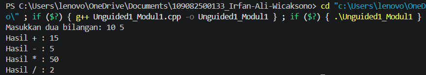

# <h1 align="center">Laporan Praktikum Modul 1 - Codeblocks IDE & Pengenalan Bahas C++ (Bagian Pertama)</h1>
<p align="center">Irfan Ali Wicaksono - 109082500133</p>

## Dasar Teori

### A. Integrated Development Environment (IDE) Code::Blocks<br/>

#### 1. Pengertian dan Karakteristik Code::Blocks
Code::Blocks merupakan perangkat lunak Integrated Development Environment (IDE) yang bersifat free, open-source, dan cross-platform. Lingkungan pengembangan terpadu ini berorientasi pada bahasa pemrograman C, C++, dan Fortran, serta menyediakan fasilitas lengkap mulai dari editor kode hingga alat pelacak kesalahan (debugger).

#### 2. Mekanisme Kompilasi dan Eksekusi Program
Untuk menjalankan program di Code::Blocks, terdapat beberapa tahapan kompilasi: Build (Ctrl+F9) untuk membangun sintaksis menjadi sebuah program utuh, Run (Ctrl+F10) untuk menjalankan program yang sudah dibangun, serta Build and Run (F9) yang mengizinkan kedua aksi tersebut berjalan berurutan secara otomatis.

#### 3. Penanganan Kesalahan Struktur Sintaksis (Error Handling)
Ketika terjadi kesalahan penulisan sintaksis kode program, Code::Blocks akan menampilkan Error Message pada panel log bawah. Pesan ini sangat penting karena menunjukkan secara spesifik nomor baris yang mengalami kesalahan serta jenis instruksi yang hilang, seperti kelalaian tanda titik koma (;).

### B. Pengenalan Bahasa Pemrograman C++ dan Struktur Dasar<br/>

#### 1. Sejarah dan Sifat Bahasa C++
Bahasa C++ diciptakan oleh Bjarne Stroustrup pada awal tahun 1980-an yang dikembangkan dari bahasa C ANSI dengan penambahan fasilitas kelas (classes). Aturan penulisan kode dalam bahasa C++ bersifat case-sensitive, artinya penggunaan huruf besar dan huruf kecil dianggap berbeda atau memengaruhi jalannya program.

#### 2. Komponen Pengenal, Variabel, dan Tipe Data
Struktur pemrograman C++ tersusun dari identifier (nama untuk variabel, konstanta, atau fungsi). Nilai data dalam program disimpan di dalam variabel yang dapat berubah secara dinamis. Tipe data dasar yang digunakan untuk menentukan jenis nilai tersebut meliputi char (karakter), int (bilangan bulat), serta float dan double (bilangan pecahan/real).

#### 3. Mekanisme Operasi Input dan Output (I/O)
Operasi masukan dan keluaran standar di dalam C++ dikelola melalui library header #include <iostream>. Fungsi cout digunakan bersama operator << untuk menampilkan atau mencetak data ke layar monitor, sedangkan fungsi cin digunakan dengan operator >> untuk menerima inputan langsung dari keyboard pengguna.


## Unguided 

### 1. Soal Unguided 1

```C++
source code unguided 1
#include <iostream>
using namespace std;

int main() {
    float a, b;
    cout << "Masukkan dua bilangan: ";
    cin >> a >> b;
    
    cout << "Hasil + : " << a + b << endl;
    cout << "Hasil - : " << a - b << endl;
    cout << "Hasil * : " << a * b << endl;
    if (b != 0) cout << "Hasil / : " << a / b << endl;
    else cout << "Tidak bisa dibagi 0" << endl;
    
    return 0;
}

### Output Unguided 1 :


##### Output 1



contoh :


##### Output 2
/(nama repository github kalian)/blob/main/(path folder menyimpan screenshot output)/(nama file screenshot output).png)

penjelasan unguided 1 

### 2. (isi dengan soal unguided 2)

```C++
source code unguided 2
```
### Output Unguided 2 :

##### Output 1
/(nama repository github kalian)/blob/main/(path folder menyimpan screenshot output)/(nama file screenshot output).png)

contoh :


##### Output 2
/(nama repository github kalian)/blob/main/(path folder menyimpan screenshot output)/(nama file screenshot output).png)

penjelasan unguided 2

### 3. (isi dengan soal unguided 3)

```C++
source code unguided 3
```
### Output Unguided 3 :

##### Output 1
/(nama repository github kalian)/blob/main/(path folder menyimpan screenshot output)/(nama file screenshot output).png)

contoh :


##### Output 2
/(nama repository github kalian)/blob/main/(path folder menyimpan screenshot output)/(nama file screenshot output).png)

penjelasan unguided 3

## Kesimpulan
...

## Referensi
[1] Triase. (2020). Diktat Edisi Revisi : STRUKTUR DATA. Medan: UNIVERSTAS ISLAM NEGERI SUMATERA UTARA MEDAN. 
<br>[2] Indahyati, Uce., Rahmawati Yunianita. (2020). "BUKU AJAR ALGORITMA DAN PEMROGRAMAN DALAM BAHASA C++". Sidoarjo: Umsida Press. Diakses pada 10 Maret 2024 melalui https://doi.org/10.21070/2020/978-623-6833-67-4.
<br>...
