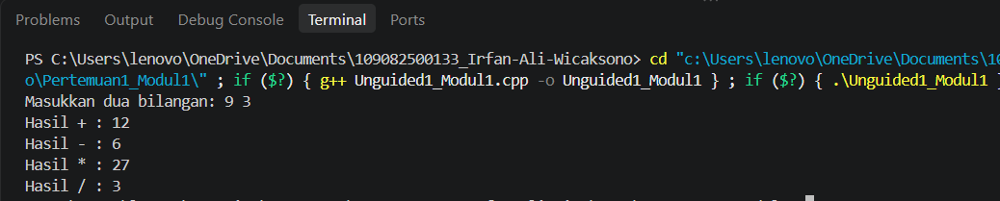
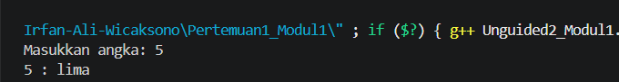
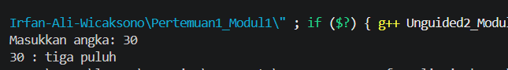
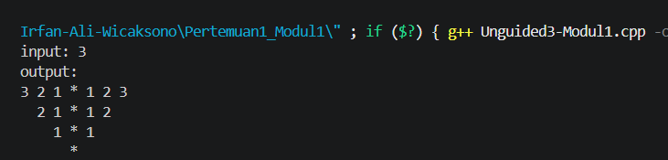
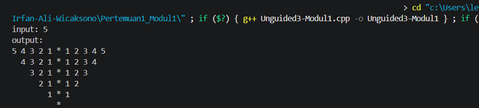

# <h1 align="center">Laporan Praktikum Modul 1 - Codeblocks IDE & Pengenalan Bahas C++ (Bagian Pertama)</h1>
<p align="center">Irfan Ali Wicaksono - 109082500133eq</p>

## Dasar Teori

### A. Integrated Development Environment (IDE) Code::Blocks
<br/>

#### 1. Definisi dan Karakteristik
Code::Blocks merupakan perangkat lunak Integrated Development Environment (IDE) yang bersifat free, open-source, dan cross-platform. Lingkungan pengembangan terpadu ini berorientasi pada bahasa pemrograman C, C++, dan Fortran, serta menyediakan fasilitas lengkap mulai dari editor kode hingga alat pelacak kesalahan (debugger).

#### 2. Proses Kompilasi dan Eksekusi Program
Untuk menjalankan program di Code::Blocks, terdapat beberapa tahapan kompilasi: Build (Ctrl+F9) untuk membangun sintaksis menjadi sebuah program utuh, Run (Ctrl+F10) untuk menjalankan program yang sudah dibangun, serta Build and Run (F9) yang mengizinkan kedua aksi tersebut berjalan berurutan secara otomatis.

#### 3. Manajemen Penanganan Error (Error Message)
Ketika terjadi kesalahan penulisan sintaksis kode program, Code::Blocks akan menampilkan Error Message pada panel log bawah. Pesan ini sangat penting karena menunjukkan secara spesifik nomor baris yang mengalami kesalahan serta jenis instruksi yang hilang, seperti kelalaian tanda titik koma (;).

### B. Komponen Program: Identifier, Tipe Data, dan Variabel<br/>

#### 1. Sejarah dan Sifat Bahasa C++
Bahasa C++ diciptakan oleh Bjarne Stroustrup pada awal tahun 1980-an yang dikembangkan dari bahasa C ANSI dengan penambahan fasilitas kelas (classes). Aturan penulisan kode dalam bahasa C++ bersifat case-sensitive, artinya penggunaan huruf besar dan huruf kecil dianggap berbeda atau memengaruhi jalannya program.

#### 2. Komponen Pengenal, Variabel, dan Tipe Data
Struktur pemrograman C++ tersusun dari identifier (nama untuk variabel, konstanta, atau fungsi). Nilai data dalam program disimpan di dalam variabel yang dapat berubah secara dinamis. Tipe data dasar yang digunakan untuk menentukan jenis nilai tersebut meliputi char (karakter), int (bilangan bulat), serta float dan double (bilangan pecahan/real).

#### 3. Mekanisme Operasi Input dan Output (I/O)
Operasi masukan dan keluaran standar di dalam C++ dikelola melalui library header #include <iostream>. Fungsi cout digunakan bersama operator << untuk menampilkan atau mencetak data ke layar monitor, sedangkan fungsi cin digunakan dengan operator >> untuk menerima inputan langsung dari keyboard pengguna.


## Unguided 

### 1. (membuat program yang menerima input dua buah bilangan bertipe float, lalu menampilkan hasil penjumlahan, pengurangan, perkalian, dan pembagian dari kedua bilangan tersebut.
)

```cpp
#include <iostream>
using namespace std;

int main() {
    float a, b;
    cout << "Masukkan dua bilangan: ";
    cin >> a >> b;

    cout << "Hasil + : " << a + b << endl;
    cout << "Hasil - : " << a - b << endl;
    cout << "Hasil * : " << a * b << endl;
    if (b != 0) cout << "Hasil / : " << a / b << endl;
    else cout << "Tidak bisa dibagi 0" << endl;

    return 0;
}
```

### Output Unguided 1 :

##### Output 1


##### Output 2


penjelasan unguided 1 
Program ini berfungsi untuk menghitung dan menampilkan hasil operasi aritmatika (penjumlahan, pengurangan, perkalian, dan pembagian) dari dua angka input berjenis float, dengan tambahan validasi agar program tidak melakukan pembagian jika angka kedua bernilai nol.

### 2. (membuat program yang menerima input bilangan bulat positif dari 0 sampai 100, lalu menampilkan nilai angka tersebut dalam bentuk tulisan teks terbilang (contoh: 79 menjadi tujuh puluh Sembilan).)

```C++
#include <iostream>
using namespace std;

int main() {
    int n;
    string s[] = {"", "satu", "dua", "tiga", "empat", "lima", "enam", "tujuh", "delapan", "sembilan"};
    
    cout << "Masukkan angka: ";
    cin >> n;
    cout << n << " : ";

    if (n == 0) {
        cout << "nol";
    } else if (n == 100) {
        cout << "seratus";
    } else if (n < 10) {
        cout << s[n];
    } else if (n == 10) {
        cout << "sepuluh";
    } else if (n == 11) {
        cout << "sebelas";
    } else if (n < 20) {
        cout << s[n % 10] << " belas";
    } else {
        int p = n / 10;
        int b = n % 10;
        cout << s[p] << " puluh";
        if (b != 0) cout << " " << s[b];
    }
    
    cout << endl;
    return 0;
}

```
##### Output 1



##### Output 2



penjelasan unguided 2
Program ini mengubah angka menjadi kata dengan cara mengecek kondisi angka khusus, lalu memecah angka puluhan dan belasan menggunakan rumus matematika (/ dan %) untuk dipasangkan dengan teks dari kamus kata (array).

### 3. ( membuat program yang dapat menerima input sebuah angka bulat, lalu menampilkan output pola angka mirror berbentuk segitiga terbalik simetris dengan karakter bintang (*) sebagai poros tengahnya.
)

```C++
#include <iostream>
using namespace std;

int main() {
    int n;
    cout << "input: ";
    cin >> n;
    cout << "output:" << endl;
    
    for (int i = n; i >= 0; i--) {
        for (int j = 0; j < 2 * (n - i); j++) cout << " ";
        for (int j = i; j >= 1; j--) cout << j << " ";
        cout << "*";
        for (int j = 1; j <= i; j++) cout << " " << j;
        cout << endl;
    }
    return 0;
}

```
### Output Unguided 3 :

##### Output 1



##### Output 2



penjelasan unguided 3
Program ini membuat pola segitiga angka cermin dengan menggunakan perulangan bersarang (nested loop) untuk mengatur jumlah spasi di awal, mencetak urutan angka menurun di sisi kiri, karakter bintang 

## Kesimpulan
Praktikum ini berhasil memberikan pemahaman mendasar mengenai penggunaan Code::Blocks IDE serta implementasi komponen dasar bahasa C++ seperti variabel, tipe data, operasi input/output, logika percabangan, dan perulangan melalui penyelesaian berbagai program studi kasus secara sistematis.

## Referensi
[1] Triase. (2020). Diktat Edisi Revisi : STRUKTUR DATA. Medan: UNIVERSTAS ISLAM NEGERI SUMATERA UTARA MEDAN. 
<br>[2] Indahyati, Uce., Rahmawati Yunianita. (2020). "BUKU AJAR ALGORITMA DAN PEMROGRAMAN DALAM BAHASA C++". Sidoarjo: Umsida Press. Diakses pada 10 Maret 2024 melalui https://doi.org/10.21070/2020/978-623-6833-67-4.
<br>...
