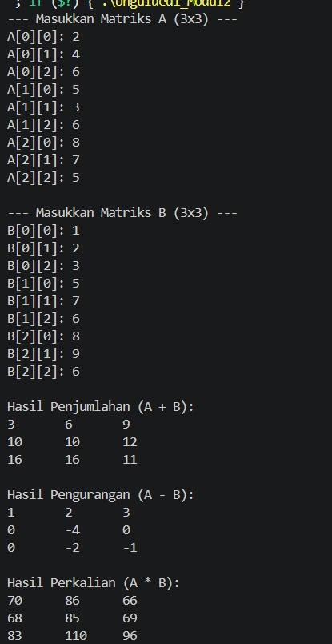
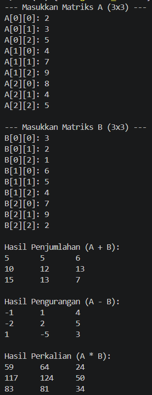

# <h1 align="center">Laporan Praktikum Modul 2 -  PENGENALAN BAHASA C++ (BAGIAN KEDUA) </h1>
<p align="center">Irfan Ali Wicaksono - 109082500133</p>

## Dasar Teori


### A. Pengenalan Array, Pointer, dan Fungsi C++<br/>

#### 1. Array (Larik)
Array adalah kumpulan data dengan nama yang sama di mana setiap elemennya memiliki tipe data yang setara dan disimpan dalam lokasi memori yang berurutan dengan indeks mulai dari 0

#### 2. Pointer & Memori
Variabel khusus yang menyimpan alamat memori (address) dari variabel lain dalam format heksadesimal, menggunakan operator & untuk alamat dan * untuk nilai yang ditunjuk.

#### 3. Fungsi & Prosedur
Blok kode terstruktur untuk tugas khusus; fungsi mengembalikan nilai balik (return), sedangkan prosedur (void) tidak mengembalikan nilai.

### B. Modul ini mempelajari dasar-dasar penyimpanan data menggunakan array, manipulasi alamat memori dengan pointer, serta penerapan modularisasi program melalui fungsi dan prosedur.<br/>

## Guided 

### 1. Array 1

```C++
#include <iostream>
using namespace std;

int main() {
    int nilai[5];

    nilai[0] = 80;
    nilai[1] = 75;
    nilai[2] = 90;
    nilai[3] = 85;
    nilai[4] = 95;

    for (int i = 0; i < 5; i++) {
        cout << "Nilai ke-" << i + 1 << " = "
             << nilai[i] << endl;
    }

    return 0;
}

```
penjelasan singkat guided 1
Sistem array menyimpan data dalam satu wadah berurutan yang diakses menggunakan nomor indeks mulai dari nol, sehingga seluruh isinya dapat diproses secara otomatis dengan perulangan.

### 2. Array 2

```C++
#include <iostream>
using namespace std;

int main() {
    int nilai[3][3] = {
        {80, 75, 90},
        {85, 90, 88},
        {70, 80, 85}
    };

    for (int i = 0; i < 3; i++) {
        for (int j = 0; j < 3; j++) {
            cout << nilai[i][j] << " ";
        }
        cout << endl;
    }

    cout << endl;
    cout << nilai[1][2] << endl;
    return 0;
}
  
```
penjelasan singkat guided 2
Program tersebut menggunakan array 2 dimensi (matriks 3x3) untuk menyimpan data dalam bentuk baris dan kolom yang kemudian dicetak ke layar menggunakan perulangan bersarang (nested loop), serta menampilkan data spesifik dari indeks baris dan kolom tertentu (seperti nilai[1][2] yang bernilai 88).

### 3. Array 3

```C++
#include <iostream>
using namespace std;

int main() {
    int data[2][2][3] = {
        {
            {10, 20, 30},
            {40, 50, 60}
        },
        {
            {70, 80, 90},
            {100, 110, 120}
        }
    };

    cout << data[0][1][2] << endl;

    return 0;
}
```
penjelasan singkat guided 3
Program tersebut menggunakan array 3 dimensi untuk menyimpan sekumpulan data bertingkat yang dianalogikan sebagai beberapa tumpukan tabel—di mana perintah cout << data[0][1][2] berfungsi untuk mengambil dan mencetak angka spesifik 60 dengan cara menelusuri lapisan pertama ([0]), baris kedua ([1]), dan kolom ketiga ([2]).

### 4. alamat/address

```C++
#include <iostream>
using namespace std;

int main () {
    int angka = 100;

    cout<< "Niai angka : " << angka << endl;
    cout<< "Alamat angka : " << angka << endl;

      return 0;

}
```
penjelasan singkat guided 4
Program tersebut memiliki sedikit kesalahan logika pada kodenya karena mencetak nilai variabel dua kali, di mana perintah cout << "Alamat angka : " << angka seharusnya menggunakan operator reference (&angka) untuk menampilkan alamat memori tempat variabel tersebut disimpan, bukan nilai variabelnya (angka).

### 5. Pointer

```C++
#include <iostream>
using namespace std;

int main () {
    int angka = 100;

    int* pointer;
    pointer = &angka;

    cout << "Nilai angka   : " << angka << endl;
    cout << "Alamat angka  : " << &angka << endl;
    cout << "Isi pointer    : " << pointer << endl;
    cout << "Nilai dari pointer  : " << *pointer << endl;

    return 0 ;
    
}
```
penjelasan singkat guided 5
Program tersebut mendemonstrasikan penggunaan pointer—variabel khusus yang menyimpan alamat memori variabel lain—di mana pointer = &angka digunakan untuk menampung alamat angka, lalu *pointer (dereference) dipakai untuk mengakses nilai 100 yang tersimpan di dalam alamat memori tersebut.

### 6. function

```C++
#include <iostream>
using namespace std;

// Fungsi untuk mencari nilai maksimum dari tiga bilangan
int maks3(int a, int b, int c) {
    int temp_max = a;
    
    if (b > temp_max) {
        temp_max = b;
    }
    if (c > temp_max) {
        temp_max = c;
    }
    
    return temp_max;
}

int main() {
    int x, y, z;
    
    // Input dari pengguna
    cout << "Masukkan nilai 1: ";
    cin >> x;
    cout << "Masukkan nilai 2: ";
    cin >> y;
    cout << "Masukkan nilai 3: ";
    cin >> z;
    
    // Memanggil fungsi dan menampilkan hasil
    cout << "Nilai maksimum = " << maks3(x, y, z) << endl;
    
    return 0;
}
```
penjelasan singkat guided 6
Program tersebut menggunakan sebuah fungsi khusus bernama maks3 untuk membandingkan tiga angka yang diinputkan pengguna, mencari nilai terbesarnya, lalu mengembalikan hasil maksimum tersebut ke fungsi main untuk ditampilkan ke layar.

### 7. Prosedur

```C++
#include <iostream>
using namespace std;

void sapa() {
    cout << "Halo, selamat datang!" << endl;
}

int main() {
    sapa();
    return 0;
}
```
penjelasan singkat guided 7
Program tersebut mendemonstrasikan penggunaan prosedur atau fungsi tanpa nilai balik (void) bernama sapa, yang dipanggil di dalam fungsi main untuk mencetak teks "Halo, selamat datang!" ke layar.

### 8. call by value/pointer/reference

```C++
#include <iostream>
using namespace std;

// 1. Call by Value (nilai asli TIDAK berubah)
void tukarByValue(int x, int y) {
    int temp = x;
    x = y;
    y = temp;
}

// 2. Call by Pointer (menggunakan pointer *, nilai asli BERUBAH)
void tukarByPointer(int *x, int *y) {
    int temp = *x;
    *x = *y;
    *y = temp;
}

// 3. Call by Reference (menggunakan alias &, nilai asli BERUBAH)
void tukarByReference(int &x, int &y) {
    int temp = x;
    x = y;
    y = temp;
}

int main() {
    // --- UJI COBA CALL BY VALUE ---
    int a = 4, b = 6;
    cout << "--- CALL BY VALUE ---" << endl;
    cout << "Sebelum: a = " << a << ", b = " << b << endl;
    tukarByValue(a, b);
    cout << "Setelah: a = " << a << ", b = " << b << " (TIDAK BERUBAH)\n\n";

    // --- UJI COBA CALL BY POINTER ---
    int c = 4, d = 6;
    cout << "--- CALL BY POINTER ---" << endl;
    cout << "Sebelum: c = " << c << ", d = " << d << endl;
    tukarByPointer(&c, &d); // Mengirim alamat memori pakai &
    cout << "Setelah: c = " << c << ", d = " << d << " (BERHASIL DITUKAR)\n\n";

    // --- UJI COBA CALL BY REFERENCE ---
    int e = 4, f = 6;
    cout << "--- CALL BY REFERENCE ---" << endl;
    cout << "Sebelum: e = " << e << ", f = " << f << endl;
    tukarByReference(e, f); // Mengirim variabel langsung tanpa &
    cout << "Setelah: e = " << e << ", f = " << f << " (BERHASIL DITUKAR)" << endl;

    return 0;
}
```
penjelasan singkat guided 8 
Call by Value mengirim salinan nilai sehingga variabel asli tetap, Call by Pointer mengirim alamat memori menggunakan tanda & untuk mengubah nilai asli, dan Call by Reference menggunakan tanda & pada parameter untuk langsung mengubah variabel asli sebagai alias tanpa perlu mengirim alamat saat dipanggil.

## Unguided 

### 1. Buatlah program yang dapat melakukan operasi penjumlahan, pengurangan, dan perkalian matriks 3x3  

```C++
#include <iostream>
using namespace std;

int main() {
    int A[3][3], B[3][3], C[3][3];

   
    cout << "--- Masukkan Matriks A (3x3) ---\n";
    for(int i = 0; i < 3; i++) {
        for(int j = 0; j < 3; j++) {
            cout << "A[" << i << "][" << j << "]: ";
            cin >> A[i][j];
        }
    }

   
    cout << "\n--- Masukkan Matriks B (3x3) ---\n";
    for(int i = 0; i < 3; i++) {
        for(int j = 0; j < 3; j++) {
            cout << "B[" << i << "][" << j << "]: ";
            cin >> B[i][j];
        }
    }

    
    cout << "\nHasil Penjumlahan (A + B):\n";
    for(int i = 0; i < 3; i++) {
        for(int j = 0; j < 3; j++) {
            cout << A[i][j] + B[i][j] << "\t";
        }
        cout << endl;
    }

    
    cout << "\nHasil Pengurangan (A - B):\n";
    for(int i = 0; i < 3; i++) {
        for(int j = 0; j < 3; j++) {
            cout << A[i][j] - B[i][j] << "\t";
        }
        cout << endl;
    }

   
    cout << "\nHasil Perkalian (A * B):\n";
    for(int i = 0; i < 3; i++) {
        for(int j = 0; j < 3; j++) {
            C[i][j] = 0;
            for(int k = 0; k < 3; k++) {
                C[i][j] += A[i][k] * B[k][j];
            }
            cout << C[i][j] << "\t";
        }
        cout << endl;
    }

    return 0;
}
```
### Output Unguided 1 :

##### Output 1



##### Output 2


penjelasan unguided 1 
Kode di atas adalah program C++ untuk meminta input dua buah matriks 3x3 lalu otomatis menghitung serta menampilkan hasil penjumlahan, pengurangan, dan perkalian dari matriks tersebut.

### 2. Berdasarkan guided pointer dan reference sebelumnya, buatlah keduanya dapat menukar nilai dari 3 variabel  

```C++
#include <iostream>
using namespace std;

// Fungsi tukar menggunakan Pointer
void tukarPointer(int *x, int *y, int *z) {
    int temp = *x;
    *x = *y;
    *y = *z;
    *z = temp;
}

// Fungsi tukar menggunakan Reference
void tukarReference(int &x, int &y, int &z) {
    int temp = x;
    x = y;
    y = z;
    z = temp;
}

int main() {
    int a = 1, b = 2, c = 3;

    cout << "--- UJI COBA POINTER ---\n";
    cout << "Sebelum ditukar: a = " << a << ", b = " << b << ", c = " << c << endl;
    tukarPointer(&a, &b, &c);
    cout << "Setelah ditukar: a = " << a << ", b = " << b << ", c = " << c << endl;

   
    a = 1; b = 2; c = 3;

    cout << "\n--- UJI COBA REFERENCE ---\n";
    cout << "Sebelum ditukar: a = " << a << ", b = " << b << ", c = " << c << endl;
    tukarReference(a, b, c);
    cout << "Setelah ditukar: a = " << a << ", b = " << b << ", c = " << c << endl;

    return 0;
}
```
### Output Unguided 2 :

##### Output 1


penjelasan unguided 2
Program C++ di atas mendemonstrasikan cara menukar nilai tiga variabel secara berputar menggunakan metode pemanggilan call by pointer dan call by reference.

### 3. Diketahui sebuah array 1 dimensi sebagai berikut :  arrA = {11, 8, 5, 7, 12, 26, 3, 54, 33, 55} Buatlah program yang dapat mencari nilai minimum, maksimum, dan rata – rata dari array tersebut! Gunakan function cariMinimum() untuk mencari nilai minimum dan function cariMaksimum() untuk mencari nilai maksimum, serta gunakan prosedur hitungRataRata() untuk menghitung nilai rata – rata! Buat program menggunakan menu switch-case seperti berikut ini : --- Menu Program Array ---  • Tampilkan isi array  • cari nilai maksimum • cari nilai minimum  • Hitung nilai rata - rata 

```C++
#include <iostream>
using namespace std;

const int ukuran = 10;
int arrA[ukuran] = {11, 8, 5, 7, 12, 26, 3, 54, 33, 55};

// Function mencari nilai minimum
int cariMinimum() {
    int min = arrA[0];
    for(int i = 1; i < ukuran; i++) {
        if(arrA[i] < min) {
            min = arrA[i];
        }
    }
    return min;
}

// Function mencari nilai maksimum
int cariMaksimun() {
    int maks = arrA[0];
    for(int i = 1; i < ukuran; i++) {
        if(arrA[i] > maks) {
            maks = arrA[i];
        }
    }
    return maks;
}

// Prosedur menghitung nilai rata-rata (void)
void hitungRataRata() {
    float total = 0;
    for(int i = 0; i < ukuran; i++) {
        total += arrA[i];
    }
    float rata = total / ukuran;
    cout << "Nilai rata - rata = " << rata << endl;
}

int main() {
    int pilihan;

    do {
        cout << "\n--- Menu Program Array ---\n";
        cout << "1. Tampilkan isi array\n";
        cout << "2. Cari nilai maksimum\n";
        cout << "3. Cari nilai minimum\n";
        cout << "4. Hitung nilai rata - rata\n";
        cout << "5. Keluar\n";
        cout << "Pilihan Anda: ";
        cin >> pilihan;

        switch(pilihan) {
            case 1:
                cout << "Isi array: ";
                for(int i = 0; i < ukuran; i++) {
                    cout << arrA[i] << " ";
                }
                cout << endl;
                break;
            case 2:
                cout << "Nilai maksimum = " << cariMaksimun() << endl;
                break;
            case 3:
                cout << "Nilai minimum = " << cariMinimum() << endl;
                break;
            case 4:
                hitungRataRata();
                break;
            case 5:
                cout << "Keluar dari program.\n";
                break;
            default:
                cout << "Pilihan tidak valid!\n";
        }
    } while(pilihan != 5);

    return 0;
}
```
### Output Unguided 3 :

##### Output 1


## Kesimpulan
Pada praktikum Modul 2 ini, kita dapat memahami penggunaan array untuk menyimpan sekumpulan data sejenis secara terstruktur dalam memori, penerapan pointer dan reference untuk memanipulasi alamat memori serta mengubah nilai variabel secara langsung, dan penggunaan fungsi serta prosedur untuk membuat program C++ menjadi lebih modular, terstruktur, dan efisien.

## Referensi
[1] Triase. (2020). Diktat Edisi Revisi : STRUKTUR DATA. Medan: UNIVERSTAS ISLAM NEGERI SUMATERA UTARA MEDAN. 
<br>[2] Indahyati, Uce., Rahmawati Yunianita. (2020). "BUKU AJAR ALGORITMA DAN PEMROGRAMAN DALAM BAHASA C++". Sidoarjo: Umsida Press. Diakses pada 10 Maret 2024 melalui https://doi.org/10.21070/2020/978-623-6833-67-4.
<br>...
