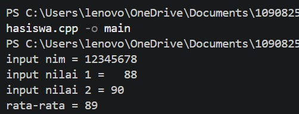
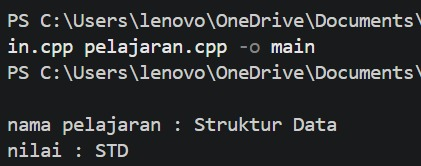

# <h1 align="center">Laporan Praktikum Modul 3 ABSTRACT DATA TYPE (ADT)  </h1>
<p align="center">Irfan Ali Wicaksono - 109082500133</p>

## Dasar Teori


### A. ABSTRACT DATA TYPE (ADT)  <br/>

#### 1. Pengertian ADT
Abstract Data Type (ADT) adalah konsep dalam pemrograman untuk membungkus suatu tipe data buatan beserta fungsi-fungsi operasionalnya menjadi satu kesatuan. Dalam C++, tipe data dibuat menggunakan struct, sedangkan fungsi atau operasionalnya dibuat menggunakan fungsi dan prosedur.

#### 2. Pembagian File dalam ADT
Penerapan ADT biasanya dibagi ke dalam 3 file utama agar kode lebih rapi dan terstruktur:
- File Header (.h): Tempat mendefinisikan tipe data struct serta mendeklarasikan nama fungsi dan prosedur.

- File Implementasi (.cpp): Tempat menuliskan isi perintah atau logika lengkap dari fungsi dan prosedur yang sudah dideklarasikan di header

- File Utama (main.cpp): Tempat program utama dijalankan dengan memanggil struktur data dan fungsi yang sudah dibuat.


### B. Modul ini mempelajari pemisahan deklarasi tipe data dan fungsi ke dalam file terpisah agar program lebih modular dan mudah dikembangkan.

## Guided 

### 1. mahasiswa.h

```C++
#ifndef MAHASISWA_H_INCLUDED
#define MAHASISWA_H_INCLUDED

struct mahasiswa {
    char nim[10];
    int nilai1, nilai2; 
};

void inputMhs(mahasiswa &m);
float rata2(mahasiswa m);

#endif // MAHASISWA_H_INCLUDED


```


### 2. Mahasiswa.cpp

```C++
#include <iostream>
#include "mahasiswa.h" // Pastikan nama file header pakai tanda kutip

using namespace std;

void inputMhs(mahasiswa &m) {
    cout << "input nim = ";
    cin >> m.nim;
    cout << "input nilai 1 = "; 
    cin >> m.nilai1;
    cout << "input nilai 2 = "; 
    cin >> m.nilai2;
}


float rata2(mahasiswa m) {
    return (m.nilai1 + m.nilai2) / 2;
}

  
```

### 3. main.cpp

```C++
#include <iostream>
#include "mahasiswa.h"
using namespace std;

int main ()
{
    mahasiswa mhs;
    inputMhs (mhs) ;
    cout << "rata-rata = " << rata2 (mhs) ;
    return 0;

} 

```
### Output guided 1 :

##### Output 1


penjelasan singkat guided 1
Program ini membagi kode ke dalam tiga file—mahasiswa.h sebagai deklarasi tipe data struct dan fungsi, mahasiswa.cpp sebagai tempat logika penginputan serta penghitungan rata-rata nilai, dan main.cpp sebagai alur utama yang mengintegrasikan semuanya untuk meminta input data mahasiswa lalu menampilkan hasil rata-ratanya.

## Unguided 

### 1. pelajaran.h 

```C++
#ifndef PELAJARAN_H
#define PELAJARAN_H

#include <string>
using namespace std;

struct pelajaran {
    string namaMapel;
    string kodeMapel;
};

pelajaran create_pelajaran(string namapel, string kodepel);
void tampil_pelajaran(pelajaran pel);

#endif
```

### 2. pelajaran.cpp

```C++
#include <iostream>
#include "pelajaran.h"
using namespace std;

pelajaran create_pelajaran(string namapel, string kodepel) {
    pelajaran pel;
    pel.namaMapel = namapel;
    pel.kodeMapel = kodepel;
    return pel;
}

void tampil_pelajaran(pelajaran pel) {
    cout << "nama pelajaran : " << pel.namaMapel << endl;
    cout << "nilai : " << pel.kodeMapel << endl;
}
```

### 3. main.cpp

```C++
#include <iostream>
#include "pelajaran.h"
using namespace std;

int main() {
    string namapel = "Struktur Data";
    string kodepel = "STD";
    pelajaran pel = create_pelajaran(namapel, kodepel);
    tampil_pelajaran(pel);

    return 0;
}
```
### Output Unguided 1 :

##### Output 1



penjelasan unguided 1 
Program ini membagi kode menjadi tiga file—pelajaran.h untuk mendefinisikan tipe data struct pelajaran beserta deklarasi fungsinya, pelajaran.cpp untuk menjalankan logika pembuatan data dan pencetakan ke layar, serta main.cpp sebagai alur utama yang mengirimkan data "Struktur Data" dan "STD" hingga hasilnya tampil di terminal.


## Kesimpulan
PPada praktikum Modul 3 ini, kita dapat memahami konsep Abstract Data Type (ADT) untuk membungkus tipe data buatan beserta fungsi operasionalnya secara modular. Pemisahan kode ke dalam tiga file utama—header (.h) untuk deklarasi, file implementasi (.cpp) untuk logika program, dan main.cpp sebagai driver—membuat struktur program menjadi lebih rapi, terorganisir, serta memudahkan proses perawatan dan pengembangan kode di masa mendatang.
## Referensi
[1] Triase. (2020). Diktat Edisi Revisi : STRUKTUR DATA. Medan: UNIVERSTAS ISLAM NEGERI SUMATERA UTARA MEDAN. 
<br>[2] Indahyati, Uce., Rahmawati Yunianita. (2020). "BUKU AJAR ALGORITMA DAN PEMROGRAMAN DALAM BAHASA C++". Sidoarjo: Umsida Press. Diakses pada 10 Maret 2024 melalui https://doi.org/10.21070/2020/978-623-6833-67-4.
<br>...
